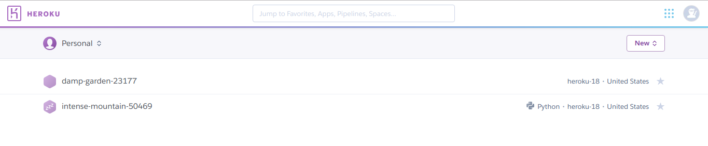
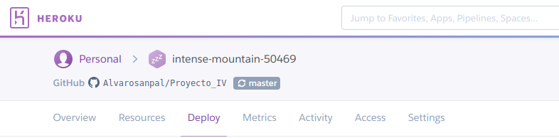
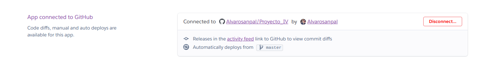
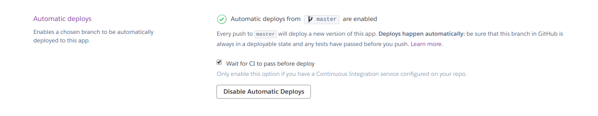
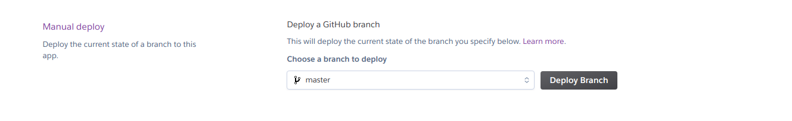
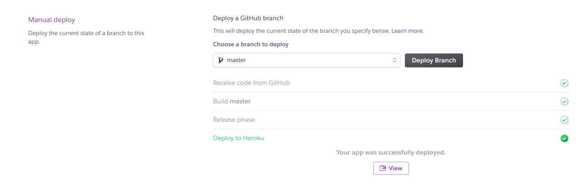
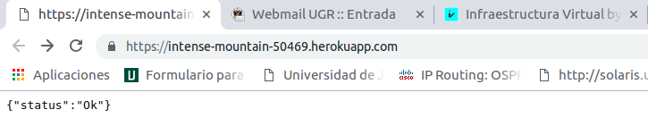

# Documentación sobre el despliegue a Heroku.

Para realizar el despliegue de la aplicación de mi proyecto he elegido Heroku, por su versatilidad y porque te permite trabajar sin abonar previamente cantidad económica.

Lo primero es darse de alta en Heroku, una vez hecho podremos ver una página con las aplicaciones que hemos desplegado, o ninguna aplicación si acabamos de hacer el registro.

Tras seleccionar la aplicación correspondiente, nos aparecerá un menú horizontal en el que le daremos a la opcion Deploy

En esta pestaña está todo lo relaccionado con el despliegue de la aplicacion.

Tendremos que elegir la forma en la que queremos que se despliegue la aplicación, en este caso será directamente desde GitHub

Para desplegarla como he comentado anteriormente tendremos que conectar nuestro perfil de Heroku con nuestro perfil de GitHub

El siguiente apartado nos da la opción de desplegar la aplicación automaticamente cada vez que hagamos un push a la rama que nosotros especifiquemos. Para ello tambien deberemos seleccionar la opción "Wait for CI to pass before deploy" de forma que antes de hacer el despliegue se asegure de que se ha pasado correctamente la integración continua de Travis en nuestro caso.

Tambien nos sale a continuación la forma de hacer el despliegue de forma manual

Tras hacer el despliegue de forma manual nos saldrá lo siguiente:

Y si pulsamos sobre el boton "View" nos redirige a la url de nuestro despliegue, mostrando el status de despliegue correcto.

